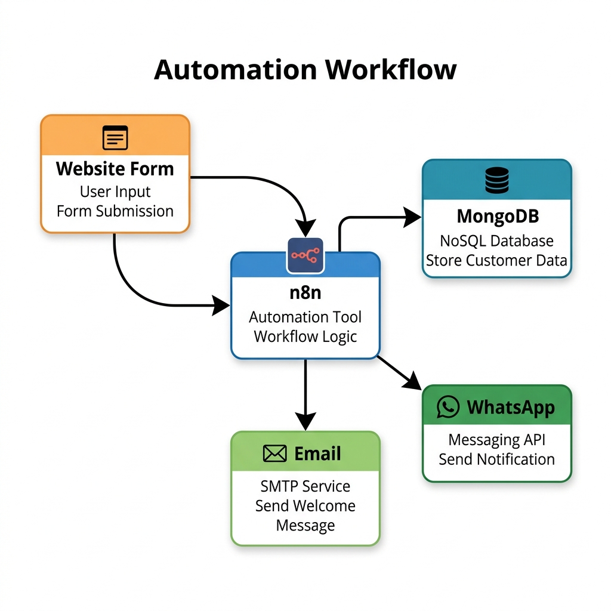

# n8n - Automation Tool

I'm learning n8n and documenting things in my own way as I understand them. Most explanations are written in Hinglish, with examples, random thoughts, and sometimes a bit of bakchodi to make concepts easier to remember.

> **WhatsApp Restaurant Chatbot Project**  
> Check out the [Project Documentation](project.md) for a complete breakdown of my WhatsApp Restaurant AI Chatbot. It explains how I connected the Meta API, n8n, Groq LLM, and Google Sheets to build a fully automated ordering system!

## Chatpter 1: n8n Intro

n8n ek automation tool hai. Matlab tu alag-alag apps ko aapas me connect karke unse kaam karwa sakta hai bina baar-baar khud click kiye.

- Let me make this more simple for you bro...

Tu jab coding karta hai ya manual koi kaam krta, for exmpl bahut saare kaam aise hote hain jo baar-baar repeat hote hain. Jaise form submit hua, email bhejna hai, database update karna hai, notification bhejni hai, Excel me entry karni hai. Har cheez ke liye alag code likho, server banao, APIs connect karo... pura scene headache ho jata hai. 

**Yahi kaam n8n easy bana deta hai.**

Maan le n8n ek smart office employee hai, ya ek robot smajh le. Tu usko ek baar bol de:
> "Bhai, agar koi website pe registration kare to uska data database me save kar dena, welcome email bhej dena aur mujhe WhatsApp pe notification de dena." 

Bas. Uske baad wo khud ye sab kaam karta rahega. bina tere kuch bole tune ek baar usko instruction de diya, vo repeat krta rhega bina ruke.

## Workflows

### 1. Basic Automation Workflow

**Website Form Fill Hua** 
↓
**n8n ne data pakda**
↓
* MongoDB me save kar diya
* Email bhej diya
* Telegram/WhatsApp pe notification bhej diya

### 2. AI Integration Workflow
AI ke saath bhai or easy ho jata hai. Maan le koi user website pe question poochta hai:

**User:** "Write a leave application"
↓
**n8n message pakdega**
↓
**ChatGPT ya Gemini ko bhejega**
↓
**AI answer banayega**
↓
**User ko wapas bhej dega**

> Matlab smjha bhai... n8n AI aur baaki apps ke beech ka middleman hai. thoda toh smjh hi gya hoga

Sabse mast baat ye hai ki isme zyada coding nahi karni padti. Drag and drop se workflow bana sakta hai. Thodi API aur JSON ki knowledge ho to kaafi powerful cheezein bana lega.

Isliye startups aur companies use karti hain kyunki:
- **Time bachta hai**
- **Development fast hota hai**
- **Automation easily ban jati hai**
- **AI ko existing systems ke saath connect kar sakte hain**
Mere hisaab se n8n ko aise yaad rakh skte hai bhai: **"n8n ek digital employee hai jo apps, APIs aur AI ko connect karke boring repetitive kaam automatically kar deta hai."**

---

## Chapter 2: n8n Architecture

**Sabse pehle toh ye samajh:**

Jab tu React app banata hai to usme components hote hain.

- Navbar
- Sidebar
- Dashboard
- Footer
- In sabko jodkar app banta hai.

Exactly waise hi n8n me:

- Trigger
- Node
- Node
- Node
- Output
- In sabko jodkar workflow banta hai.
---

***Har workflow 3 cheezon se milkar banta hai.***

**1. Trigger**

Ye workflow ko start karta hai.

For Example:
- Form Submit
- New Email
- Webhook
- Schedule
- Trigger
    ↓
- Workflow Start

Without trigger kuch nahi hota.

**2. Nodes**

n8n me har block ko Node bolte hain.

for Example:

- Webhook Node
- Email Node
- OpenAI Node
- Google Sheets Node
- MongoDB Node

Ye Lego blocks ki tarah hote hain.

**3. Execution**

Workflow run hone ko execution bolte hain.

- Trigger
↓
- Node 1
↓
- Node 2
↓
- Node 3

Ye pura execution hai.
