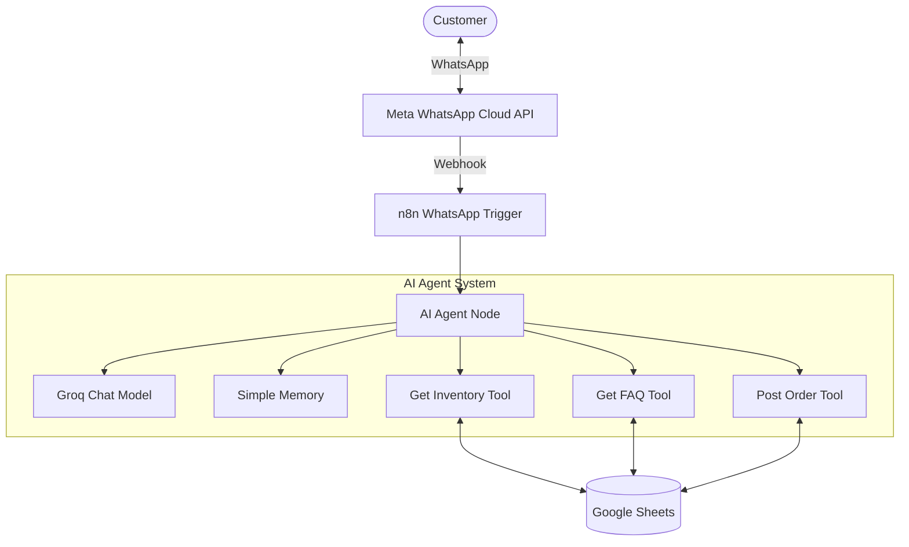
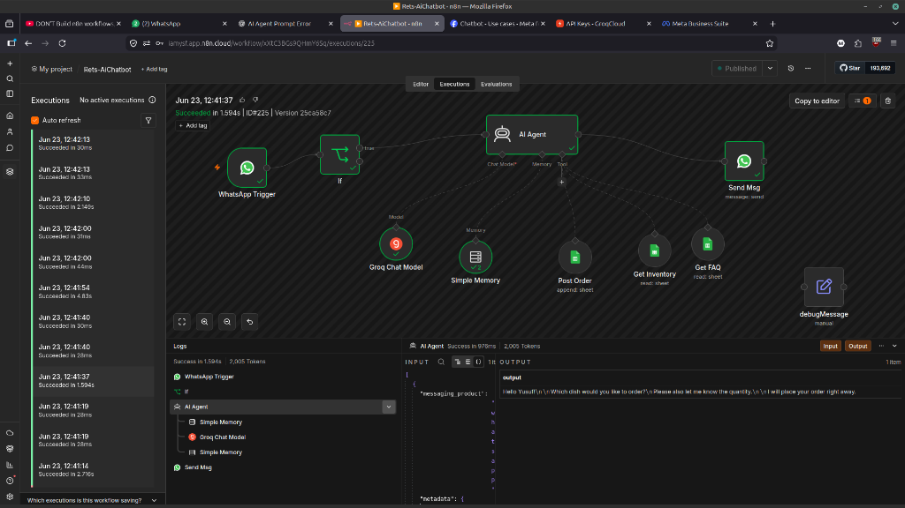
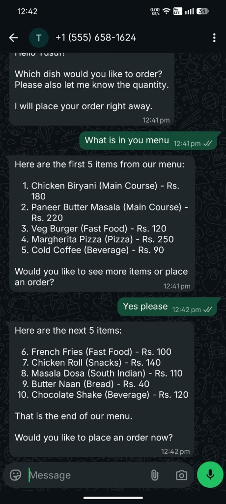
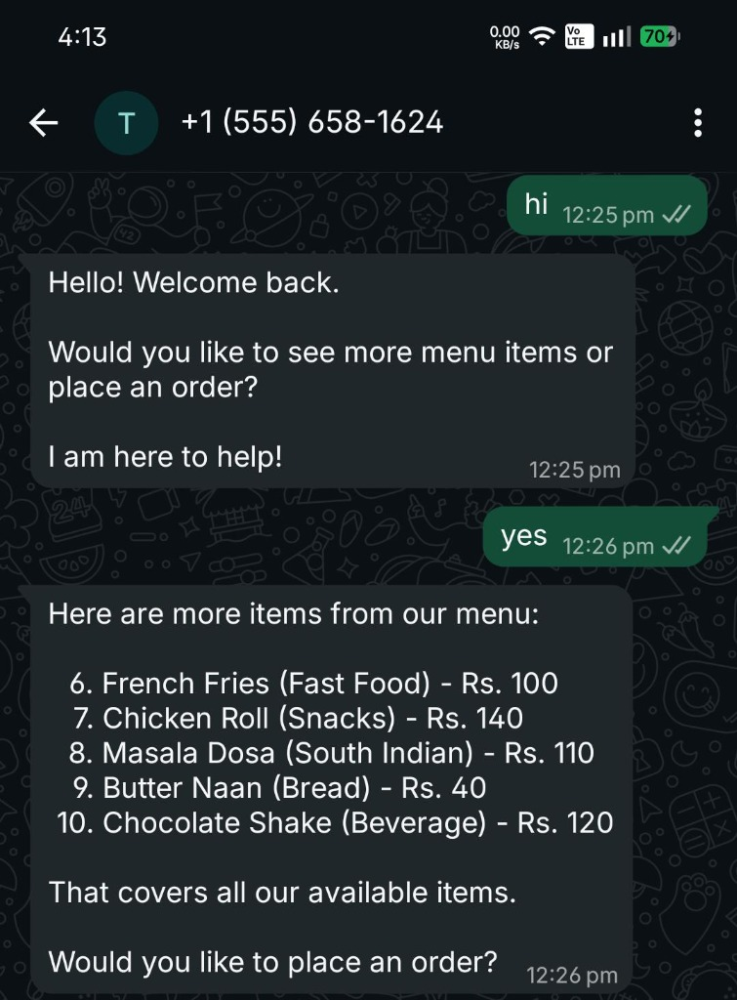

# WhatsApp Restaurant AI Chatbot

## Project Overview
This project is an automated, AI-powered restaurant assistant operating entirely on WhatsApp. It leverages the Meta WhatsApp Cloud API to interact with customers, n8n Cloud for workflow automation, Groq's Large Language Model for natural language understanding, and Google Sheets as a lightweight database.

> **Just a quick note:** I built this project while learning n8n to get some hands-on experience with workflow automation and AI. While it works perfectly as a demonstration, it's a personal prototype and not meant to be a full-scale, production-ready enterprise app!

The chatbot is designed to handle common restaurant tasks such as:
- Greeting customers and maintaining context
- Showcasing the menu and prices
- Answering Frequently Asked Questions (FAQs)
- Taking customer orders and saving them directly into a database

---

## Architecture



---

## Services & Technologies

### 1. Meta WhatsApp Cloud API
- **Purpose**: Serves as the communication bridge. It receives incoming messages from customers and sends back the chatbot's responses.
- **Configuration**: Requires a WhatsApp Test Number, a Meta Developer App, and a Webhook connected to n8n.

### 2. n8n Cloud
- **Purpose**: The central nervous system. It orchestrates the workflow, manages the AI agent, and executes tools.
- **Workflow Name**: Restaurant AI Chatbot

### 3. Groq API (LLM)
- **Purpose**: The "brain" of the chatbot. It understands customer intent, decides when to fetch data (using tools), and generates human-like responses.
- **Model**: `llama-3.3-70b-versatile` (Alternatives: `qwen3-32b`, `llama-3.1-8b-instant`)

### 4. Google Sheets Database
Used as a lightweight, easily accessible database. It contains three main sheets:

#### Inventory Sheet
Stores the restaurant's menu.
- **Columns**: `Item Name`, `Category`, `Price`, `Available`
- **Example**: `Chicken Roll` | `Snacks` | `140` | `Yes`

#### FAQ Sheet
Stores answers to common questions.
- **Columns**: `Question`, `Answer`
- **Example**: `What are your timings?` | `We are open from 10 AM to 10 PM.`

#### Orders Sheet
Records customer orders.
- **Columns**: `Customer Name`, `Phone`, `Items`, `Quantity`, `Timestamp`

---

## n8n Workflow Breakdown



The n8n workflow consists of several interconnected nodes that process each message:

### 1. WhatsApp Trigger
- **Role**: Listens for incoming WhatsApp messages and triggers the workflow.

### 2. IF Node
- **Role**: A filter to ensure the workflow only continues if the incoming event is an actual message (ignoring status events like "read" receipts).
- **Condition**: `{{ $json.messages !== undefined }}`

### 3. AI Agent (The Core)
- **Role**: Acts as the main controller. It uses the Groq model to process the text, remembers past messages using the **Simple Memory** node, and interacts with tools to fetch or save data.
- **System Prompt Guidelines**: 
  - Be a friendly restaurant assistant.
  - Use the **Inventory tool** for menu/price inquiries (max 5 items at a time).
  - Use the **FAQ tool** for restaurant-related questions.
  - Use own knowledge if tools fail, but never reveal internal systems/tools to the customer.
  - Keep responses concise (under 10 lines) and WhatsApp-friendly.

### 4. The Tools
These nodes connect the AI Agent to Google Sheets:
- **Get Inventory Tool**: Fetches menu items when a customer asks what's available.
- **Get FAQ Tool**: Fetches answers for questions regarding timings, delivery, etc.
- **Post Order Tool**: Appends a new row to the Orders sheet when a customer places an order.

### 5. Send WhatsApp Message
- **Role**: Takes the final response generated by the AI Agent and sends it back to the customer's WhatsApp.

---

## Message Flow Examples

Here are some real interactions with the chatbot:

<p align="center">
  
  
</p>

### Example 1: Greeting
1. **Customer**: "Hi"
2. **System**: WhatsApp Trigger → IF Node → AI Agent → Groq Model → Send Message
3. **Bot**: "Hello! How can I help you today?"

### Example 2: Checking the Menu
1. **Customer**: "Show menu"
2. **System**: WhatsApp Trigger → AI Agent decides to use **Get Inventory Tool** → Fetches data from Sheets → AI Agent formats response → Send Message
3. **Bot**: 
   ```text
   1. Chicken Roll - Snacks - Rs. 140
   2. French Fries - Fast Food - Rs. 100
   3. Masala Dosa - South Indian - Rs. 110
   
   Would you like more items?
   ```

### Example 3: Placing an Order
1. **Customer**: "I want 2 Chicken Rolls"
2. **System**: AI Agent remembers the previous conversation context → Uses **Post Order Tool** → Saves order to Sheets → Send Message
3. **Bot**: "Your order has been placed successfully."

---

## Future Improvements
To make the chatbot even more robust, the following features can be added:
- Real-time order confirmation and delivery tracking
- Customer profiles for personalized recommendations
- Payment gateway integration (e.g., Razorpay)
- Multi-language support
- Table booking capabilities
- An admin and analytics dashboard for inventory and sales management
